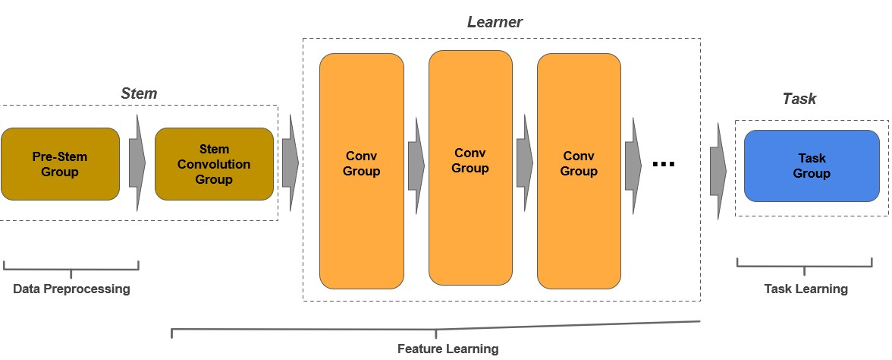
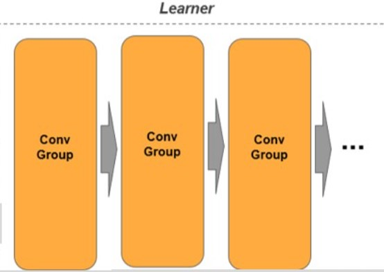

# Background

Google researchers have developed a novel CNN architecture, called the JumpNet, in 2020. JumpNet incorporates best practices of ResNet v2 and introduces a new skip connection that minimizes the number of parameters and matrix operations, while preserving accuracy and without going deeper in layers.

# Model

The code is written in a procedural design pattern where there is a pattern for constructing and coding a model which can be re-applied across a wode range of cases. For a CNN, the design pattern consists of a stem, learner, and task. The image below illustrates the design pattern.

The stem component is the entry point to the neural network and its primary purpose is to perform a coarse level feature extration while reducing the feature maps to a size designed for the learner component.

The learner component is where feature learning and feature extraction are performed. This component consists of one or more convolutional groups, where each group consists of one or more convolutional blocks. 

Convolutional blocks are assembled into groups based on the number of input or output filters as well as the size of the input or output feature maps.

Lastly, the task component is associated with learning the task such as classification or object detection.

Complete notebook with the code implementation in each component can be found [here](https://github.com/tjeng/JumpNet/blob/main/JumpNet.ipynb).

# Results

After implementing the code for JumpNet, the model is trained on CIFAR dataset, which contains 60,000 color images in 10 classes, with 6,000 images in each class. The dataset is divided into 50,000 training images and 10,000 testing images. 

Weight initialization, hyperparameter tuning, early stopping and learning rate scheduler are techniques applied to stabilize the weights of the model, find the optimal hyperparameter setting to maximize training of the model for validation accuracy, and maximize efficiency during training. 

With 4x4x256 feature maps, as opposed to 8x8x1024 in popular model architectures used to train on CIFAR dataset, JumpNet is able to achieve comparable accuracy of 82% on the test set. This validates research that JumpNet preserves the accuracy while minimizing the number of matrix operations with reduced feature maps.
